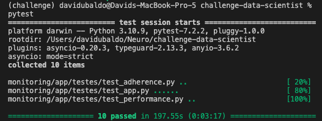

# Minha solução para o case de monitoramento de modelos

Esse repositório contém a API que resolve o problema proposto pela seleção da Neurotech.

O _main.py_ contém o app. Além disso, adicionei uma função para predição, que me ajudou a testar o BaseModel _entrada.py_. Esse BaseModel serve para validar a entrada da requisição no endpoint responsável pelo cálculo da performance. Comentei o propósito de algumas funções cuja aplicação não é tão óbvia.

Criei um diretório de testes, onde fiz alguns testes unitários. Eles podem ser rodados com o pytest, que resulta na seguinte mensagem:

Os testes exigidos em forma de Notebook estão no _tests.ipynb_. Os endpoints possuem o comportamento esperado exigido pelo desafio.

Além disso, propus um modelo que obteve um ROC Score levemente melhor do que o fornecido pelo desafio, este que poderia ser melhorado, mas não consegui fazer tudo o que eu queria em tempo ágil. O modelo criado por mim pode ser encontrado no model_creation.ipynb. Lá entro em mais detalhes do meu processo de modelagem do problema. 

Obrigado pela oportunidade!
